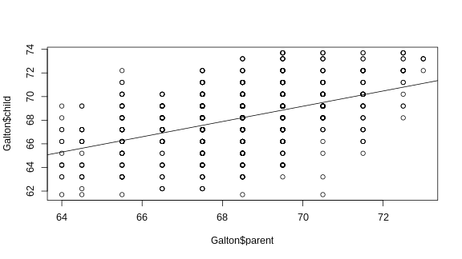

## Objectives 

1. To generate a linear model using galton's data.
2. To build a Shinyapp to Predict a child height based on mom and dad height's.

--- .class #id 

## Galton's data
Galton (1886) presented these data in a table, showing a cross-tabulation of 928 adult children born to 205 fathers and mothers, by their height and their mid-parent’s height. He visually smoothed the bivariate frequency distribution and showed that the contours formed concentric and similar ellipses, thus setting the stage for correlation, regression and the bivariate normal distribution.

--- .class #id 

## Generating linear model

The code below was used to generate the linear model that is used for the prediction, also we can see the plot corresponding to this linear model.

```r
library(HistData)
data(Galton)
galton_model <- lm(child ~ parent, data=(Galton))
```
 

--- &radio

## Question

Imagine this escenario: The dad's height is 70" and the mom's height 64". Which is the predicted son's height?

1. 66.276
2. 68.489
3. _67.243_
4. 67.890

*** .hint 
You can access to our shinyapp on this URL https://carojasq.shinyapps.io/DevData
*** .explanation 
The right  answer is 67.243.

